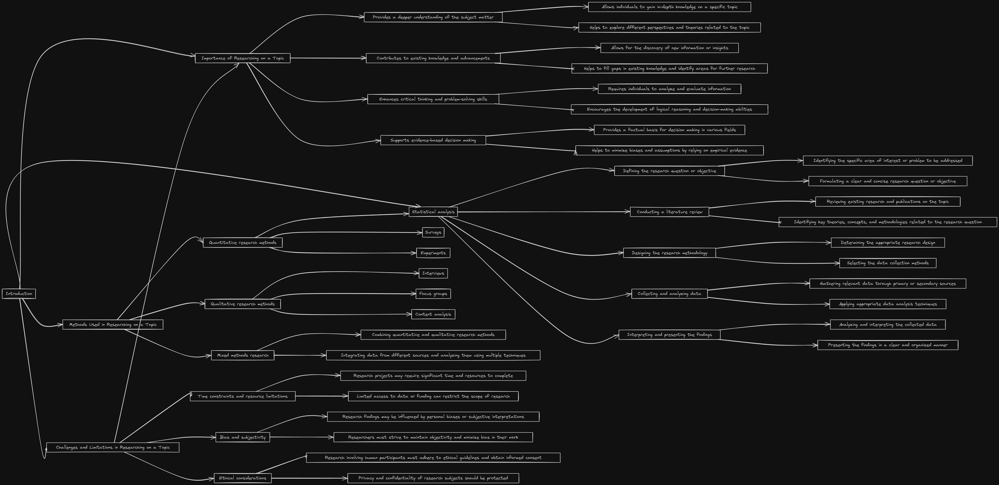

# ResearchPlot

<div style="display: flex; align-items: center;">
  
  <p style="margin-left: 20px; flex: 1;">
    The LangChain Research Assistant is a Python project that leverages the power of the LangChain library and the OpenAI API to conduct research on a given topic, keyword, question, or statement. The project aims to understand the user's scenario, ask relevant questions, and generate a Mermaid code, which is then converted into a flowchart for clear and concise representation of the research findings.
  </p>
</div>

**Note:** This project utilizes [Mermaid.js](https://mermaid-js.github.io/mermaid/) to create flowchart images.

## Features

- Topic analysis and understanding.
- Intelligent question generation based on user input.
- Automatic generation of Mermaid code for a flowchart representation.
- Integration with the OpenAI API for enhanced natural language processing.

## Example Output



## Getting Started

### Prerequisites

Before running the project, ensure that you have an OpenAI API key. You can obtain one [here](https://platform.openai.com/api-keys).

## Installation

1. **Clone the repository:**

   ```bash
   git clone https://github.com/PratikSingh121/ResearchPlot.git
   cd ResearchPlot
   ```

2. **Set up your OpenAI API key:**

   Obtain an OpenAI API key by following the steps below:

   - Visit [OpenAI's API Key page](https://platform.openai.com/api-keys).
   - Create an account or log in if you already have one.
   - Generate a new API key and copy it.

   Replace `OPENAI_API_KEY` in the `.env` file with the API key you obtained.

   ```bash
   # .env
   OPENAI_API_KEY = 'OPENAI_API_KEY'
   ```

3. **Install dependencies:**

- Ensure you have the required Python dependencies by running the following command:

  ```bash
  pip install -r requirements.txt
  ```

- Install Mermaid.js using npm. Run the following command:

  ```bash
  npm install -g @mermaid-js/mermaid-cli
  ```

4. **Run the main script:**

- Execute the following command in your terminal:

  ```bash
  python main.py
  ```

## Usage

1. Execute the main script.
2. Enter the topic, keyword, question, or statement when prompted.
3. ResearchPlot will analyze the input, ask relevant questions, provide Mermaid code for a flowchart and the flowchart itself.
4. Visualize the flowchart to represent the research findings.
5. Image is saved in outputs folder.
